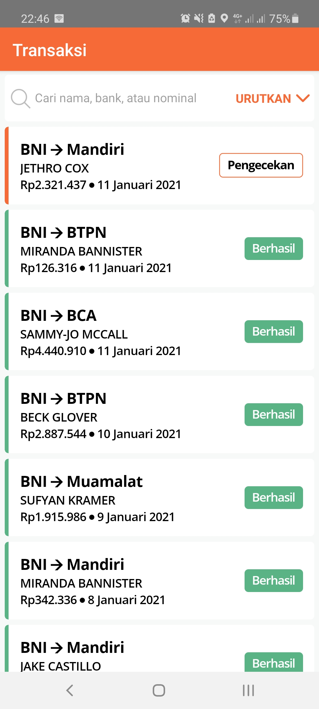
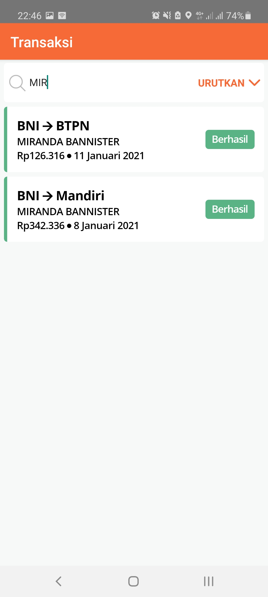
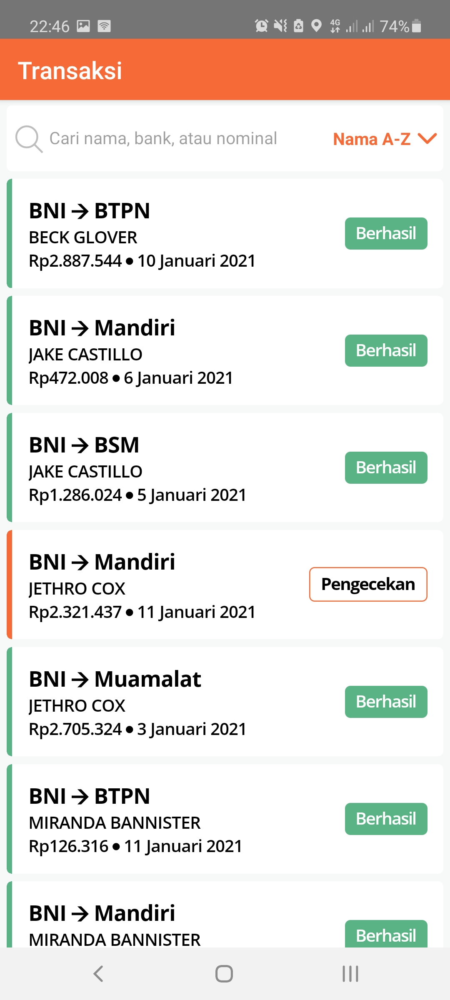
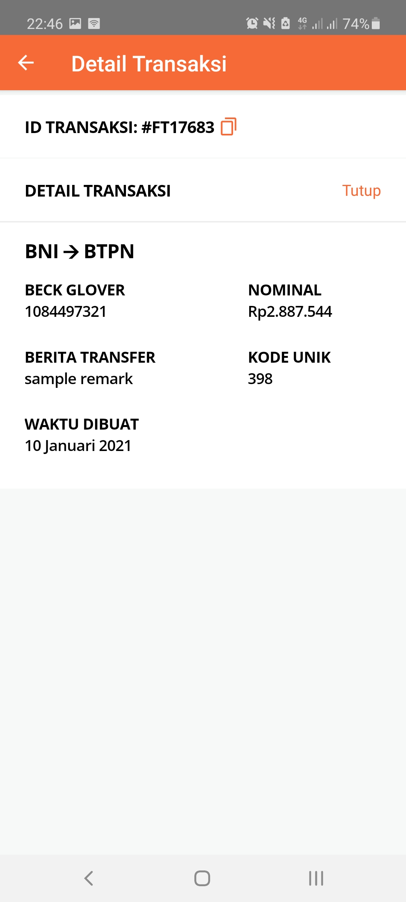

# flip-react-native-test

## Reqruirements
* [npm](https://www.npmjs.com/get-npm) or [yarn](https://yarnpkg.com)
* [react native](https://reactnative.dev/docs/environment-setup)

## Usage for development
1. Open your terminal or command prompt
2. Type `git clone https://github.com/Vikraardiansyah/flip-react-native-test.git`
3. Open the folder and type `npm install` or `yarn install` to install dependencies
4. Don't forget to connect your device to PC or using AVD
5. Type `npm start` or `yarn start` to run metro server
6. Type `npm run android` or `yarn run android` to run android application

## Screenshots

    
    
    
    

## Release APK

